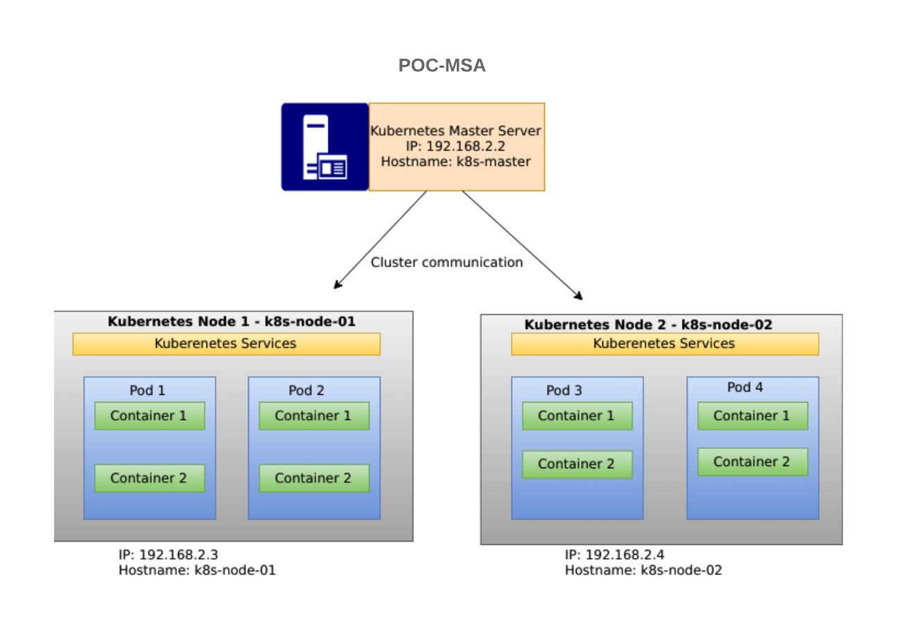

# Automatisation du deploiement de Kubernetes

Ces playbooks permettent d'automatiser le deploiement du cluster de kubernetes avec un master et deux nodes.

## Architecture du POC


## Prerequis pour les VM
- Redhat8/Centos8
- VM avec une connection internet
- Connexion ssh par private_key 
- Installation de ansible sur le desktop client

## Provisioning des VM en local (VirtualBox) avec vagrant

L'utilisation de vagrant permet d'automatiser le deploiement des VM (Centos8) sur virtualbox

Installez vangrant sur la machine local

Pour demarer les instances :

1. `cd vagrant`
2. `cd masterk8s && vagrant up`
3. `vagrant ssh`

Pour permettre a ansible de se connecter via public/private key generer une paire key sur votre machine local:

1. `ssh-keygen`
2. copier `~/.ssh/id_rsa.pub` vers les instances (Master, Workers) `~/.ssh/authorized_keys`


## Les differentes playbooks
- k8s-prep.yml : Installe un nombre de packages requis sur toutes les instances (les taches sont definit dans le role)
- master.yml : Initialisation du Control Panel du cluster K8S
- workers.yml: Permet d'enregistrer les nodes au cluster

## Les taches dans les roles

Le role contient les taches suivantes:

- Installation des packages requis
- Configuration des exigences système standard - Disable Swap, Modify sysctl, Disable SELinux
- Installez et configurez un environnement d'exécution de conteneur de votre choix - cri-o, Docker, Containerd
- Installez les packages Kubernetes - kubelet, kubeadm et kubectl
- Installez Firewalld sur Kubernetes Master et Worker nodes

## Comment utiliser ce role:

- Mettre a jour l'inventory, e.g:

```
$ vim hosts
[k8s-nodes]
192.168.1.30
192.168.1.31
192.168.1.32

[master]
192.168.1.30

[workers]
192.168.1.31
192.168.1.32
```

## Executer les Playbooks


1. Installation des prerequis
- `$ cd ansible`
```
$ ansible-playbook -i hosts k8s-prep.yml
```
2. Initialisation du Control Panel du cluster K8S
```
$ ansible-playbook -i hosts master.yml
```
3. Enregistrement des nodes au Master
```
$ ansible-playbook -i hosts workers.yml
```


